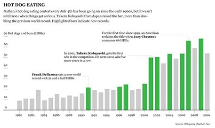

My current efforts to get better with Data Analysis and somewhat Data Science have led me down a rabbit hole. There is just so much stuff to know, to master, to remember, to keep up with.

My previous experience with R can be summed up as an R course during my bachelors degree (psychology) and me using it for my master thesis (cognitive neuroscience). So both contexts didn't leave me much time and/or motivation to dabble with R a bit more. Now I have got the time and motivation to do so.

The final push for a more sincere approach to learning more about Data Analysis, Data Science etc. was one of the many YouTube videos by Thu Vu about [building a Data Analysis Portfolio](https://www.youtube.com/watch?v=XYKuslcJp7A). I decided to give it a shot and set myself up with a plan which includes:

- Learning the basics of data visualization
- Learning the basics of ggplot
- Learning the basics of tableau (which I have no prior experience with)

For each of these bigger areas I want to include atleast one project to have a practical aspect.

So, not knowing where to begin, I grabbed the book Visualize this (Yau, 2011) and started reading through it. As the first highlights are waiting for further reworking into proper notes in Obsidian, the author presented me my first challenge: Reproduce the graph that can be seen in Fig. 1.




## Preparation

```{r, include=FALSE}
MEDIUM_API_TOKEN = "2be8610ecc0882945acf0a7f0b101e86e3db91fa2f416eed79ae237a1597ee59d"
```

```{r packages}
# load packages
library(pacman)
p_load(
  dplyr,
  here,
  ggplot2, ggsci, ggthemes, ggtext,
  stringr,
  extrafont  # to resolve error while saving plots as pdf; due to altered font
  )
```

```{r set figure props}
knitr::opts_chunk$set(
  fig.width = 8,
  fig.height = 5,
  fig.align = "center"
  )
```

```{r data import}
# import dataset
hotdogs <- read.csv(
  "http://datasets.flowingdata.com/hot-dog-contest-winners.csv",
  sep = ",",
  header = TRUE
  )

# save as a local csv file
write.csv(hotdogs,
          here("hotdogs.csv"),
          row.names = FALSE  # TRUE adds running number variable
          )
```

## simple examples

```{r first barplot, fig.cap="simple barplot"}
# directly create a barplot with just the numbers
barplot(
  hotdogs$Dogs.eaten
  )

# now add labels for the years
barplot(
  hotdogs$Dogs.eaten,
  names.arg = hotdogs$Year
  )
```

Trying this with other variables will require choosing other variables for the numbers as well as 'names.arg'.

```{r third barplot}
# try other options
barplot(
  hotdogs$Dogs.eaten,
  names.arg = hotdogs$Year,
  col = "red",  # color of the bars
  border = NA,  # removes the outline of the bars
  xlab = "Jahr",
  ylab = "Gegessene Hot Dogs & Buns (HDB)"
  )
```

## filtering and separately colored bars by winners
Now I want to color the bars separately, filtered by the winning country. In the first example, the winning state (USA) will be represented in dark red, the rest in gray bars.

```{r color vector1}
# create a vector of colors
fill_colors <- c()  # creates empty vector
for ( i in 1:length(hotdogs$Country) ) {
  if (hotdogs$Country[i] == "United States") {
    fill_colors <- c(fill_colors, "#821122")
  } else {
      fill_colors <- c(fill_colors, "#cccccc")
  }
}
```

The barplot with differently colored bars, by winner of contest (US).

```{r fourth barplot}
barplot(
  hotdogs$Dogs.eaten,
  names.arg = hotdogs$Year,
  col = fill_colors,  # color of the bars
  border = NA,  # removes the outline of the bars
  xlab = "Jahr",
  ylab = "Gegessene Hot Dogs & Buns (HDB)"
  )
```

How many times did Germany win the competition?

```{r color vector2}
fill_colors <- c()  # creates empty vector
for ( i in 1:length(hotdogs$Country) ) {
  if (hotdogs$Country[i] == "Germany") {
    fill_colors <- c(fill_colors, "#821122")
  } else {
      fill_colors <- c(fill_colors, "#cccccc")
  }
}

barplot(
  hotdogs$Dogs.eaten,
  names.arg = hotdogs$Year,
  col = fill_colors,  # color of the bars
  border = NA,  # removes the outline of the bars
  xlab = "Jahr",
  ylab = "Gegessene Hot Dogs & Buns (HDB)"
  )
```

Just once.


## filtering and separately coloring bars by new records
How does the barplot look when we highlight the years in which a new record was claimed?

```{r fifth barplot}
fill_colors <- c()  # creates empty vector
for ( i in 1:length(hotdogs$New.record) ) {
  if (hotdogs$New.record[i] == 1) {
    fill_colors <- c(fill_colors, "#821122")
  } else {
      fill_colors <- c(fill_colors, "#cccccc")
  }
}

barplot(
  hotdogs$Dogs.eaten,
  names.arg = hotdogs$Year,
  col = fill_colors,  # color of the bars
  border = NA,  # removes the outline of the bars
  xlab = "Jahr",
  ylab = "Gegessene Hot Dogs & Buns (HDB)"
  )
```

Now let's give this barplot a bit of spacing and a title.

```{r sixth barplot}
barplot(
  hotdogs$Dogs.eaten,
  names.arg = hotdogs$Year,
  col = fill_colors,  # color of the bars
  border = NA,  # removes the outline of the bars
  xlab = "Jahr",
  ylab = "Gegessene Hot Dogs & Buns (HDB)",
  space = .5,  # controls the spacing between bars and inherently the barwidth
  main = "Results of the Hot Dog Eating Contest from 1980 to 2010"
  )
```

Now this could be exported as pdf and further refined in an illustrator app of my choice.

But... let's try to replicate the graph from the book (Fig.4-5) with ggplot2. Step by step.

## Replicate the barplot with ggplot2 -- step by step
### First: prepare the theme and some variables.

```{r prep for the ggplot}
# set a cleanier ggplot theme
ggplot2::theme_set(ggpubr::theme_pubr())

# set variables for plot title and annotation labels to make the code for the actual plot less cluttered
p_title = "HOT DOG EATING"
p_subtitle = "Nathan\'s hot dog eating contest every July 4th has been going on since the early 1900s, but it wasn\'t until 2001 when things got serious. Takeru Kobayashi from Japan raised the bar, more than doubling the previous world record. Highlighted bars indicate new records."
p_caption = expression(paste("Taken and recreated from ", italic("Visualize this"), " by Nathan Yau, 2011"))
# p_label_frank = expression(atop(paste(bold("Frank Dellarosa"), " sets a new world record.")))
p_label_frank = c(
  expression(paste(bold("Frank Dellarosa"), " sets a new world")),
  expression(paste("record with 21 and a half hot dogs."))
  )
p_label_takeru = c(
  expression(paste("In 2001, ", bold("Takeru Kobayashi"), ", wins his first")),
  expression(paste("competition. His winning streak will last")),
  expression(paste("for six years."))
  )
p_label_joey = c(
  expression(paste("For the first time since 1999, an American reclaims the title")),
  expression(paste("when ", bold("Joey Chestnut"), " gobbles down 66 hot dogs - more")),
  expression(paste("than three times the record in 1991."))
  )

# modify the axis ticks and labels
p_breaks = seq(1980, 2010, by = 1)  # vector for tick marks on x-axis
p_breaks_y = seq(0, 70, by = 10)  # vector for tick marks on x-axis
p_labels = seq(1980, 2010, by = 1)  # vector for labels on x-axis
p_labels[seq(2, length(p_labels), 2)] <- ""  # every second label should be blank
```

### Second: create the plot

```{r barplot_2, warning=FALSE}
nicer_plot <- hotdogs %>%
  ggplot(  # gives the basic coordinate system
    aes(
      x = Year,
      y = Dogs.eaten,
      fill = factor(New.record)  # has to be a discrete variable for it to work as wished
      )
  ) +
  geom_bar(  # gives the basic bars
    width = .7,
    position = position_dodge(width = 0.3),
    stat = "identity"
    ) +
  labs(  # sets labels for title etc.
    title = p_title,
    subtitle = str_wrap(p_subtitle, 93),
    fill = NULL,
    x = NULL,
    y = NULL,
    caption = p_caption
  ) +
  theme(  # sets properties of the plot elements
    title = element_text(family = "Georgia"),
    plot.title = element_text(
      face = "bold"
      ),
    plot.title.position = "plot",
    axis.text = element_markdown(
      family = "Georgia",
      size = 8
      ),
    plot.caption = element_text(hjust = .94),
    axis.line.y = element_blank(),
    legend.position = "none",  # removes legend
    plot.margin = margin(1, -21, 1, 0, "pt")
    ) +
  scale_fill_manual(
    values = c("lightgrey", "#3db545"),  # colors for the different fills
    labels = c("no record", "new record")  # labels for the legend
    ) +
  scale_y_continuous(
    limits = c(0, 72),
    breaks = p_breaks_y,
    expand = expansion(mult = c(0, .1))  # have the geoms touch the x-axis
    ) +  
  scale_x_continuous(
    breaks = p_breaks,
    labels = p_labels
    ) +
  # add explaining annotations in the plot
  annotate(
    "text",
    x = 1982,
    y = 72,
    label = "Hot dogs eaten",
    size = 3,
    family = "Georgia",
    hjust = "right"
    ) +
  annotate(
    "text",
    x = c(1980, 1980),
    y = c(32.5, 28.5),
    label = p_label_frank,
    size = 3,
    family = "Georgia",
    hjust = "left",
    parse = TRUE
    ) +
  annotate(
    "segment",
    x = 1991,
    xend = 1991,
    y = 28.5,
    yend = 21.5,
    linetype = 9
    ) +
  annotate(
    "segment",
    x = 1989,
    xend = 1991,
    y = 28.6,
    yend = 28.5,
    linetype = 9
    ) +
  annotate(
    "text",
    x = c(1984, 1984, 1984),
    y = c(55, 51, 47),
    label = p_label_takeru,
    size = 3,
    family = "Georgia",
    hjust = "left",
    parse = TRUE
    ) +
  annotate(
    "segment",
    x = 2001,
    xend = 2001,
    y = 51,
    yend = 50,
    linetype = 9
    ) +
  annotate(
    "segment",
    x = 1995,
    xend = 2001,
    y = 51,
    yend = 51,
    linetype = 9
    ) +
  annotate(
    "text",
    x = c(1990, 1990, 1990),
    y = c(70, 66, 62),
    label = p_label_joey,
    size = 3,
    family = "Georgia",
    hjust = "left",
    parse = TRUE
    ) +
  annotate(
    "segment",
    x = 2007,
    xend = 2007,
    y = 70,
    yend = 66,
    linetype = 9
    ) +
  annotate(
    "segment",
    x = 2005,
    xend = 2007,
    y = 70,
    yend = 70,
    linetype = 9
    )

nicer_plot
```

```{r, warning=FALSE}
# to save as pdf/png
ggsave(
  here("nicer_plot.png"),
  plot = nicer_plot,
  # width = 350,  # orig: 242;
  width = 8,  # orig: 242;
  height = 5,  # orig: 150
  # height = 160,  # orig: 150
  units = "in"
  )

# be advised: the exported pdf doesn't seem to get the font right!

# if this is giving an error due to fonts i. e.:
# make sure, the used font is adequately imported: fonts()
# use extrafont::loadfonts() to load it into R
```

Wow. What did change so people could eat more than double the amount what was supposed to be a former world record (recipe, food quality, social circumstances etc.)?

## Conclusion
If I want to do fancy up my graphics I'll do that in postprocessing with a dedicated design software (Affinity Designer i. e.). Replicating this figure from Yau (2011) with ggplot2 was kind of a pain in the ass. For a first pass it looks good enough, but there are some things I still don't like and can't resolve without putting much more time and effort in. Or should I rather say: waste much more time and effort. Because at this point the ratio of spent effort and achieved goal is way off.

### What was the most p.i.a?
Formatting the text annotations to be italic, bold AND then have some linebreaks, too. The simple markdown syntax didn't work at all. I could have done this in a fraction of the time I spent searching for a solution.

### What's still bugging me
- The y-axis title is off, but I can't place it further to left without clipping it.
- The connecting segment-annotation are build from two separate segment which more or less dont' intersect nicely (especially the for 2001 and 2007). Right now I don't bothered by replacing those segment with curves.
- The graphic didn't survive the export to pdf well enough. Which is a real bummer. Curiously when I opened the pdf in Affinity Designer the fonts where displayed correctly. An export to .svg sucked even more. All segment-annotations were gone. The export to png was good, but I prefer vector graphics.

All in all this was a lengthy learning experience with a lot of troubleshooting and skimming through github, stackoverflow and the respective Online-Cookbooks (Graphics, [Rmarkdown Cookbook](https://bookdown.org/yihui/rmarkdown-cookbook/)) and other sources like [r-charts.com](https://r-charts.com) and [cedricscherer.com](https://www.cedricscherer.com).
